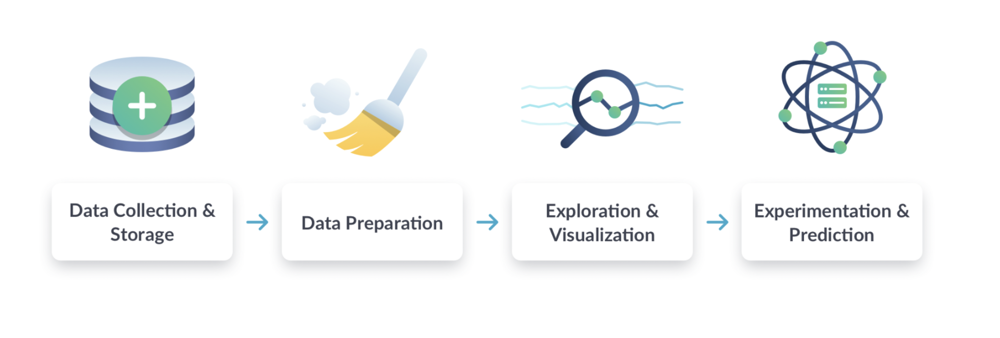

# 01-Introduction to Data Science

## What is data science?

### It makes data work for you

It's **a set of methodologies** for **taking in thousands of forms of data** that are available to us today, and **using them to draw meaningful conclusions**. 

**Data** is being collected all around us. 
Every like, click, email, credit card swipe, or tweet is a new piece of data that can be used to **better describe the present** or **better predict the future**.

### What can data do?

- Describe the current state of an organization or process
  - Like our energy consumption
  - This can be accomplished with dashboards or alerts, simplifying time-intensive reporting processes.
- Detect anomalous events
  - Automatically detecting a new event that is unexpected or abnormal.
- Diagnose the causes of events and behaviors
  - For instance your activity on Spotify or Netflix. 
- Predict future events
  - We can use new techniques to take various causes into account and predict potential outcomes. 
  - Further, we can evaluate the probability of our prediction mathematically to clarify our **level of uncertainty**.

### Why now?

The answer is pretty obvious: we're **collecting more data than ever before**.

### Data science workflow

In data science, we generally have four steps to any project:

1. Data collection and Storage
  - Collect data from many sources, such as surveys, web traffic results, geo-tagged social media posts, and financial transactions. 
  - Once collected, we store that data in a safe and accessible way.
  - At this point, data is in its raw form, so the next step is to prepare data. 

2. Data preparation
  - This includes "cleaning data", for instance: 
    - finding missing
    - finnding duplicate values 
    - and then converting data into a more organized format.

3. Exploration and Visualization
  - explore and visualize the cleaned data. This could involve building dashboards to track how the data changes over time or performing comparisons between two sets of data.

4. Experimentation and Prediction
  - run experiments and predictions on the data. For example: 
    - this could involve building a system that forecasts temperature changes or 
    - performing a test to find which web page acquires more customers.

### Example :: Customer segmentation workflow

1. Download the data
2. Reformat the delivery date on all entries to br in the same time zone
3. Create a line chart that shows decay in subscriptions by cohort
4. Cluster the users into different personas and perform a regression to predict churn for each cluster.

### Example :: Building a customer service chatbot

Data collection and storage

- Gather customer information for each conversation
- Load the transcripts into the data team's database
- Collect the timestamps for each transcript.

Exploration and Visualization

- Create a bar chart of the number of conversations of each type
- Plot the number of conversations vs. the time of day.

Experimentation and Prediction

- Create an algorithm that classifies the initial customer questions.
- Use a machine learning model to predict possible responses for each question.

---

## Applications of data science

### Case studies

- Fraud detection: by use credit card trasaction data to determine the probability that the transaction is fake.
- Smart watch: develop an algorithm that recognizes accelerometer data as representing one of those two states: walking or running.

### More case studies

- Traditional machine learning
- Internet of Things (IoT)
- Deep learning

### Deep Learning

Deep learning = a subfield of machine learning.

- In deep learning, multiple layers of mini-algorithms, called "neurons", work together to draw complex conclusions.

- Requires much more training data
  - Deep learning takes much, much more training data than a traditional machine learning model, but is also able to learn relationships that traditional models cannot. 

- Used in complex/data-intensive problems
  - Image recognition
  - Language learning/understanding

---

## Data science roles and tools

### Roles in data science

Generally, there's four jobs: 

- Data Engineer
- Data Analyst
- Data Scientist
- Machine Learning Scientist

### Data engineer

Within the data science workflow, they focus on the first stage: **Data collection and Storage**.

A data engineer:

- Design **infrastructure** so that **data is not only collected**, but **easy to obtain and process**.
- Build custom **data pipelines** and **storage systems**. 
- Control **the flow of data**.

To sum, Data engineers focus on **Store and Maintain data**.

### Data engineering tools

- **SQL**: to store and organize data by building and configuring SQL storage solutions
- **Java, Scala, Python**: to process data
- **Shell** on the command line: to automate and run tasks
- **Cloud computing**: to ingest and store large amounts of data

### Data analyst

Within the workflow, they focus on the middle two stages: 

- **Data preparation**
- **Exploration and Visualization**

A data analyst: 

- **Clean** data first
- Then **simple analyze and describe** the **present** via data by exploring the data 
- Finally create visualizations, reports, and dashboards to **summarize** data

Analysts have **less programming** and **less stats experience** than the other roles. 

To sum, Data analysts focus on **Visualize and Describe data**.

### Data analyst tools

- **SQL**: to retrive and aggregate data relevant to their analysis.
- (Optional) **Python or R**: to clean and analyze data.
- **Spreadsheets (Excel or Google Sheets)**: to perform *simple* analyses on *small* quantities of data.
- **Business Intelligence, or BI Tools, such as Tableau, Power BI, or Looker**: to create dashboards and *share* their analyses. 

### Data scientist

Within the workflow, they focus on the last three stages: 

- Data preparation 
- Exploration and Visualization
- Experimentation and Prediction

A data scientist:

- Have a strong background in statistics.
- Run experiments and analyzes to find **new** insights from data, rather than solely describing data. 
- Use **traditional machine learning** for prediction and forecasting.

To sum, Data scientists focus on **Gain new insights from data**.

### Data scientist tools

- **SQL**: to retrive and aggregate data relevant to their analysis.
- **Python or R**: to use popular data science libraries, such as *pandas (Python)* or *tidyverse (R)*.

### Machine learning scientist

Within the workflow, they do the last three stages with a strong focus on prediction.

- Data preparation 
- Exploration and Visualization
- Experimentation and Prediction [**Mainly focus on here**]

A Machine learning scientist:

- Similar to data scientists, but with a machine learning specialization.
- Use training data to 
  - Preditions and Extrapolations
  - Classification 
    - by classifying larger, unrulier data, whether its to classify images that contain a car, or create a chatbot. 
- They go beyond traditional machine learning with **deep learning**.

To sum, Machine learning scientists focus on **Predict with data**.

### Machine learning tools

- **Python or R**: to create their **predictive models** by using popular machine learning libraries, such as Spark or TensorFlow, to run powerful deep learning algorithms.

---
