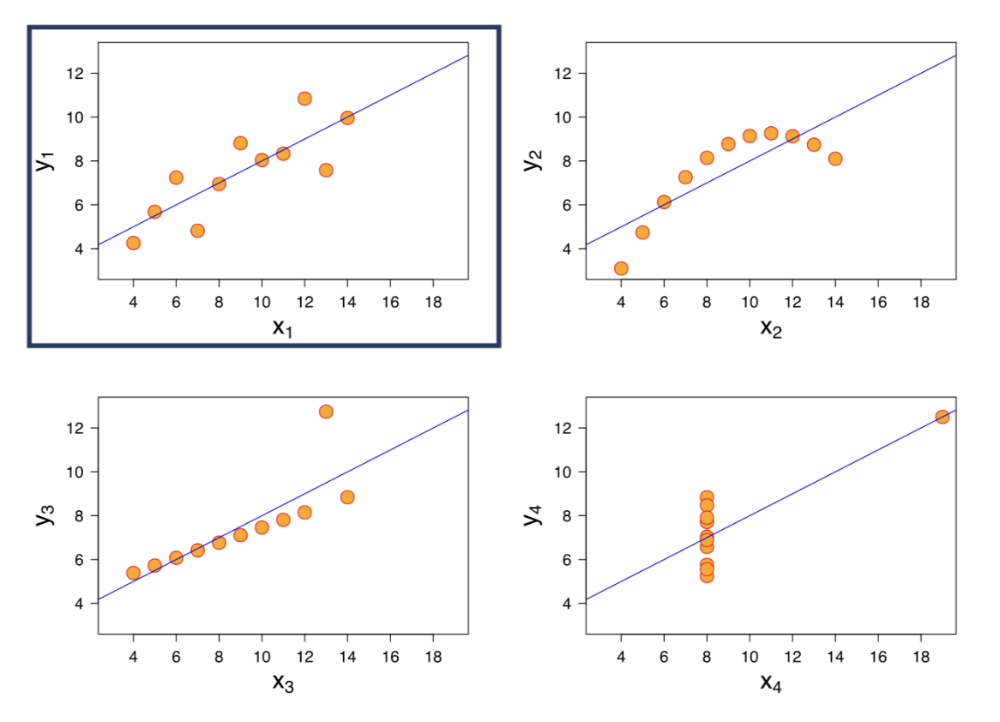

# 03-Preparation, Exploration, and Visualization

## Data preparation

**Data preparation** happens after collecting and storing the data.

Why prepare data?

- Real-life data is messy and dirty.
- Preparation is done to prevent:
  - errors
  - incorrect results
  - biasing algorithms

### Tidy data

One fundamental aspect of cleaning data is "tidiness". 

Tidy data is a way of presenting **a matrix of data**, with **observations on rows** and **variables as columns**.

### Remove duplicates

In general, you want to remove duplicates. 

### Create Unique ID

You want a way to uniquely identify each observation.

It can be a combination of features, but the safest way is to assign a unique ID.

### Ensure Homogeneity

All variables should use the same standard.

For example, for size column, Lis is in the US, she inputted her size **in feet**. Sara and Hadrien are based in Europe, they **use the metric system**.

- Programmatically, you can filter values above 2.5 meters, and apply a division by 3.281 to get the metric value.

Similarly, countries should follow the same format. The United States and France are abbreviated, but Belgium is written in full. 

- Let's fix that by making all abbreviated.

### Verify Data types

Another common issue relates to data types.

The tools you use might be able to infer data types for each column, but you'd better make sure they are correct. 

For example:

- the **Age** column is encoded as **text**. 
  - If you try to get the mean, you'll get an error, because the average of two words doesn't make sense. 
  - You should change the type of this feature to **numbers**.

### Handle Missing values

Problem: Missing values are common and occur for various reasons: 

- Data entry
  - Ex. The agent doing the entry was distracted.
- Error
  - Ex. The person surveyed did not understand the question.
- Valid missing value
  - Ex. It's on purpose, for example an event that has not happened yet. 
  
Solution: There are several ways to deal with missing values: 

- Impute
  - You can substitute the exact value if you have access to the source. 
  - For example, you can take an aggregate value, like the mean, median or max depending on the situation. 
- Drop
  - You can drop the observation altogether, but each observation you remove means less training data for your model. 
- Keep
  - You can keep it as is and ignore it, if **your algorithm allows it**.

---

## Exploratory Data Analysis (EDA)

Exploratory Data Analysis (EDA) is a process that consists in: 

- Exploring the data 
- Formulating hypotheses about it
- Assessing its main characteristics, with a strong emphasis on visualization.

EDA happens **after data preparation**, but they can get **mixed**. 

- EDA can reveal new things that need cleaning.

### Descriptive statistics vs. Visualization

For example, All four datasets have 

- identical mean and variance both for the x and y features. 
- identical correlation coefficient
- the same linear regression equation (the straight line that tries to go through all points). 

The point is, they seem awfully similar! But is that the case?
No! Here are the four graphs. They all tell a different story, **that pure metrics can't fully convey**.

Draw the graphs of those four datasets, you can see the difference!

- The first graph displays a linear relationship,
- The second one has a non-linear relationship.
- In the third graph, we see the linear line is thrown off by one point that has an extreme y value.
- A similar thing happens with the fourth dataset. We should have no correlation, but one extreme point is enough to display a strong one. 

To sum, **Descriptive** statistics do better, but **can be misleading**; 
**Visualization** teaches us the most. That's why EDA relies heavily on this last technique. This was an extreme example, to make a point.

### Outlier

Another thing you do during EDA is **look for outliers**, that is, unusual values. 

Whether they are **errors or valid**, it's nice to know about them, as they **can throw your results off**.

---

## Visualization

One picture is worth a thousand words, if the picture makes sense...

### Colorblindness

You should also be mindful of colorblindness: 

- You may distinguish **red and green** very well, but some people don't, and more than you think. 
- You can find a lot of information on colorblindness online, as well as **palettes of colors that are accessible to colorblind people**.

### Readable fonts

You should also use readable fonts: 

- **Sans-serif** ones are easier to read. 
- There are nicer fonts available, sure, but your readers should focus on your **viz message**, not on the font.

### Label, label, label

An image is worth a thousand words, but **words do help**: 

- **Title**: Your graphs should always have a title, so we know what we're looking at.
- **X,Y axis label**: The x and y axis should have labels, otherwise they could be anything.
- **Legend**: And you should provide a legend if you use **colors and patterns**, so that we know what they refer to.

### Dashboards

If a picture is worth a thousand words, then what is **worth a thousand pictures**? >> **A dashboard**!

A dashboard shows **several pictures together** can be more insightful than looking at them separately, or trying to pack all the insights in one graph. 

For example, your **car dashboard** indicates the car speed, the motor rotation speed and the proportion of gas left.

- Individually, these pieces of information are useful. But together, they paint a much bigger picture and make your trip more safe and more comfortable.

That's what dashboards do: 

- **Group all the relevant information in one place to make it easier to gather insights and act on them**. 

### BI tools

Business Intelligence tools let you:

- clean
- explore
- visualize data, and 
- build dashboards, 

without requiring any programming knowledge. 

Such tools are: 

- Tableau, 
- Looker, or 
- Power BI.
- Of course, you can also do that programmatically using Python, R, or even JavaScript.

The next level is to make your visualization **interactive**, which BI tools make really easy, for example:

- Drill down to more specific information when select a piece of visualization.
- Filter data based on a criteria and change the whole dashboard.

---
