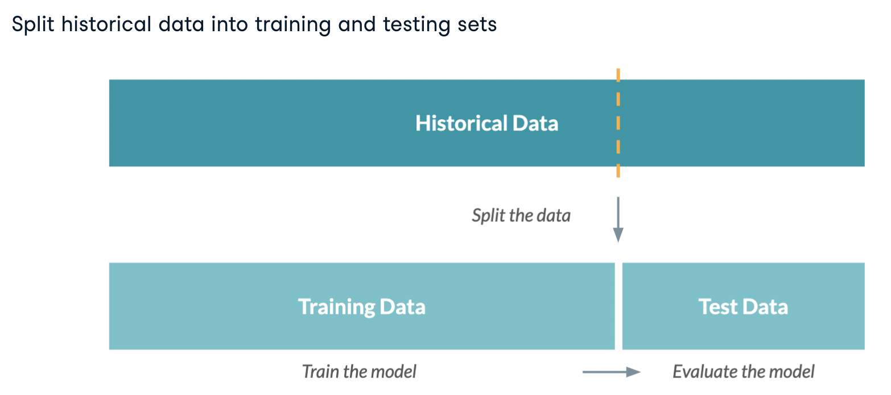

# 04-Experimentation and Prediction

**Experiments** help drive **decisions** and draw **conclusions** by the following steps:

1. Form a question
2. Form a hypothesis
3. Collect data
4. Test the hypothesis with a statistical test
5. Interpret results

## A/B Testing

### Case study: which is the better blog post title?

1. Form a question
  - Does blog title A or blog title B result in more clicks?

2. Form a hypothesis
  - Both blogs will result in the same amount of clicks

3. Collect data
  - Randomly divide our audience into two groups, each seeing a different title
    - 50% users will see blog title A
    - 50% users will see blog title B
    - Track click-through rate until sample size reached

4. Test the hypothesis with a statistical test
  - Is the difference between the titles' click-through rate significant?

5. Interpret results
  - Choose a title
  - Or ask more questions and design another experiment!

### What is A/B Testing?

This is called **A/B Testing**, often called **Champion/Challenger testing**, and it's used to **make a choice between two options**.

### Terminology Review

**Sample size** = the number of data points used.

**Statistical significance** = result is likely not due to chance, given the statistical assumptions made.

- Use **statistical tests** to calculate this: t-test, z-test, ANOVA, Chi-square test, etc.

### A/B Testing Steps

There are four steps in an A/B test: 

1. Picking **a metric** to track 
2. Calculating **sample size**
3. Running the **experiment**
4. Checking for **significance**

### 1. Pick a metric to track: click-through rate

Our metric is **click-through rate** = the percent of people who **click on a link after viewing the title**.

### 2. Calculating sample size

Next, we'll run the experiment until we reach a sample size **large enough to be certain that results aren't due to random chance**. 

The size depends on a **"baseline metric"** that helps gauge any changes. 

- In our case, a **"baseline metric"** is **how often people click on a link to one of our blogs usually**. 

If the rate is much larger or smaller than 50%, then we need a larger sample size. 

- **Click-rate** is typically **< 3%**.

The sample size depends on **the sensitivity we want**. 

- **A test's sensitivity** tells us **how small of a change in our metric we can detect**. 
- **Larger sample sizes** allow us to detect **smaller changes**. 

You might think that we want a high sensitivity, but we actually want to optimize for an amount that is meaningful for our question. 

- For example, if the first and second title are clicked on by 5% and 5.01% of viewers respectively, an extra .01% clicks to our blog post won't make a difference to us. However, if this was comparing 100m race time, an .01 difference would be significant.

### 3. Running the experiment

We run our experiment until we reach **the calculated sample size**. 

Stopping the experiment before or after could lead to biased results.

> NOTE: Until we have reached the desired sample size, we can't be sure that our results aren't significant. We might just not have enough data.

### 4. Checking for significance

Once we reach the target size, we check our metric.

We see some difference between the titles, but **how do we know if it's meaningful?** 

- We check by performing a test of statistical significance. 
- If they are significant, we can be reasonably sure that the difference is not due to random chance, but to an actual difference in preference.

#### What if the results aren't significant? 

- If there are any differences in click rates, they're smaller than the threshold we chose when determining the sensitivity. 
- Running our test longer won't help because it'll only detect a smaller difference and we've decided that smaller differences are irrelevant! 
- There still might be a difference in click rates between the titles: but **that difference isn't important to us for making decisions**.

To sum, we can't conclude **which option is better** because **the observed difference is likely due to random chance**.

---

## Time series forecasting

### Modeling in data science

What is a statistical model?

- Models attempt to represent a real-world process with statistics. 
- Models define mathematical relationships between variables, including random variables, with equations. 
- Models are based on statistical assumptions and historical data.

### Predictive modeling

Predictive modeling is **a sub-category of modeling** used for prediction. 

With the model, we can **enter new inputs and see what outcome it outputs**.

- For instance, you can enter a future date in a model of unemployment rate to get **a prediction of what the unemployment rate will be next month**.
- The output can be the probability of an outcome, for example, **the probability that a tweet is fake**.

Predictive models can be **as simple as a linear equation** with an x and y variable to **a deep learning algorithm** that is uninterpretable by humans. 

### Time series data

Time series is a series of data points **sequenced by time**. 

Examples
- daily stock
- gas prices over the years
- unemployment rates
- a patient's heart rate during surgery

Time series data is usually plotted as **a line graph** like this, with **time on the x-axis**.

Often times when **plotting time series**, you can find **patterns**, for example:

- **Seasonality**: when there are repeating patterns related to time such as months and weeks.

### Forecasting time series

**Time series data** is used in predictive modeling to **predict metrics at future dates**. We call this **forecasting**. 

For example: 

- predicting rainfall next month
- predicting the state of traffic in the next half hour 
- predicting the stock market in a couple of hours 
- predicting the population will be in 20 years.

We can **build predictive models** using **time series data from the past years or decades** to generate predictions. 
 
This uses **a combination of statistical and machine learning methods**.

### Confidence intervals

Confidence intervals = Model is **X%** sure that the true value will fall in this area.

For example:

- We see two confidence intervals: 80% and 95%. 
  - The model is 80% sure that the true value will be in the area labeled as 80. 
  - Same goes with the area labeled as 95. 
  
If we're using this forecast to make big decisions, **confidence intervals can help us buffer for the unexpected**.

---

## Supervised machine learning

**Machine learning** is a set of methods for making predictions based on existing data.

**Supervised machine learning** is a subset of machine learning where the existing data has a specific structure: it has **labels** and **features**, for example:

- Recommendation systems
- Diagnosing biomedical images
- Recognizing hand-written digits
- Predicting customer churn.

### Model training

**Labels** are what we want to predict, like the customer churning. 

**Features** are data that might help predict the **label**, such as profession or date of last purchase. 

Once we have the features and labels, we **train a model** and use it to make **predictions on new data**.

### Model evaluation

After training a model, how do we know if it's any good? 

It's always good practice not to allocate all of your historical data for training. 

Withheld data is called **a test set** and can be used to evaluate the goodness of the model.

For example, we put that **test data** into our **newly trained model** and it **predicts** that all the customers remain.

If we calculate the overall accuracy of that model, it technically has a high accuracy of 97% because it was correct on 970 of the 1000 customers. This is despite never correctly labeling a customer churning. 

Checking both outcomes is important for rare events. Only by examining the accuracy of each label do we get 0% accuracy at predicting churn when churn was the actual outcome. This model is not useful to use in its current state, so we'll have to re-train it with different parameters or more data.

---

## Clustering

**Clustering** is a set of machine learning algorithms that

- Divide data into categories, called **clusters**. 

Clustering can help us see **patterns in messy datasets**. Use cases:

- Customer segmentation: Divide customers into segments
- Image segmentation: Images into categories
- Anomaly detection: Behaviors into typical and anomalous

### Supervised vs. Unsupervised machine learning

**Clustering** is part of a broader category within Machine Learning called **"Unsupervised Learning"**. 

**Unsupervised Learning** differs from Supervised Learning in **the structure of the training data**. 

While **Supervised Learning** uses data with **features and labels**, **Unsupervised Learning** uses data with **only features**. 
This makes Unsupervised Learning, and clustering, particularly appealing: you can use it even when you don't know much about your dataset.

### Steps to develop clustering model

1. Defining features
2. Some clustering algorithms need us to define how many clusters we want to create.
  - It is up to you to decide the final number of cluster by using your domain knowledge to help decide.
3. Finally, use the results of our clustering to solve our problems.

### Summary

- **Clustering** is an **Unsupervised** Machine Learning method that divides **an unlabeled dataset** into **different categories**. 
- In order to perform clustering, we must first select relevant features of our dataset. 
- Next, we select the number of clusters based on hypotheses about our data. 
- Finally, we use the results of our clustering to solve our problems, whether it's defining new species, segmenting customers, or classifying movies into genres.

---
