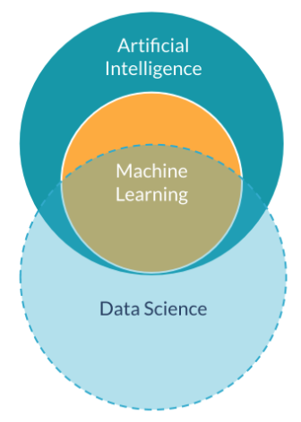
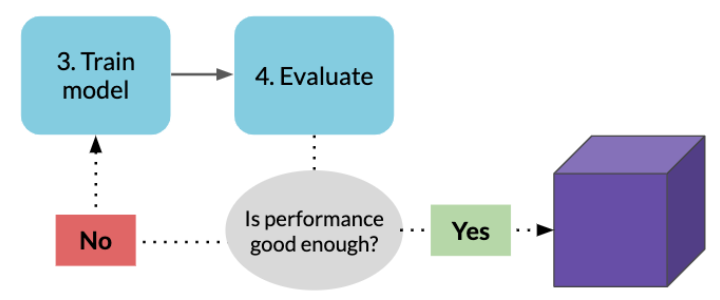
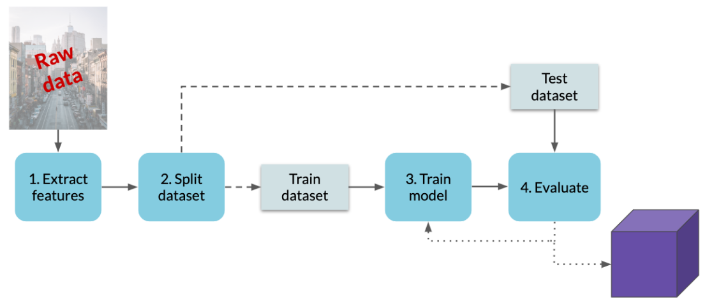

# 01-What is Machine Learning?

## Artificial intelligence (AI)

Today, when people refer to AI, they're most likely referring to machine learning. 

AI is **a huge set of tools** for making computers behave intelligently. 

It comprises of several **sub-fields**, including *robotics* and *machine learning*.

---

## Data science

**Data science** is about discovering and communicating **insights from data**.

**Machine learning** is often **an important tool for data science work**, especially for making **predictions from data**.

  

> NOTE: **AI** and **data science** do NOT share the same goal. AI is concerned with **intelligence in computers**, while data science is about using **data for insights**. However, there is overlap, it's usually **machine learning**!

---

## Machine Learning

Machine learning has many applications and overlaps with several other fields. 

We like to define machine learning as **a set of tools for making inferences and predictions from data**.

### What can it do?

Let's compare **inference** and **prediction** tasks to better understand what machine learning can do.

- **Prediction** is about **the outcome of future events**. 
  - For example, will it rain tomorrow? 
- **Inference** is more vague because it's about drawing insights. We can infer **the causes of events and behaviors**, or we can also **infer patterns**:
  - For example, why it rains? 
    - We may get a combination of factors like the month, humidity, and temperature. 
  - For instance, what are the different types of weather conditions? 
    - Such as a rain or overcast. 

Ultimately, these tasks can work together, because **inferences help make predictions**, however they require different types of machine learning.

### How does it work?

Machine learning methods are taken primarily from **statistics** and **computer science**. 

Machine learning is extremely powerful because it **gives computers the ability to learn without being explicitly programmed to do so**. 

Essentially, machine learning learns **patterns from existing data** and applies it to **new data**. 

- For example, it can process archived emails to learn what spam looks like on its own. 
- Then, using what it learned, it can detect spam in new emails. 

For machine learning to be successful, it needs **high-quality data**.

### Machine learning model

A machine learning model is **a statistical representation of a real-world process**, like how we recognize cats or hourly changes in traffic. 
 
**A process** is modeled using **data**.

We can enter new inputs into a model to get an outcome.

- For example, if we make a model based on historical traffic data, we can enter a future date into the model to predict how heavy traffic will be tomorrow afternoon.

The **output** can even be **the probability of an outcome**.

- For example, the probability that a tweet is fake.

---

## Machine learning concepts

### Three types of machine learning

There are three types of machine learning:

1. Reinforcement learning
  - Used for deciding **sequential actions**, like a robot deciding its path or its next move in a chess game. 
  - Reinforcement learning is not as common as the others and uses complex mathematics, like game theory.
  
2. Supervised learning 
3. Unsupervised learning

> NOTE: The main difference between supervised and unsupervised learning lies in their **training data**.

### Training data

**Training data** = Existing data that ML learn from

**Training a model** = When a model is being built and learning from training data

- This can takes nanoseconds to weeks depending on the size of the data.

### Supervised learning :: Training data

**Target variable** is what we want to predict. 

**Labels** are values for the target variable. They can be numbers or categories.

**Rows** are the **observations or examples** that our model will learn from. 

- You should get as many of rows as possible.

**Columns** are **features** = different pieces of information that might help **predict the target**.

- The magic of machine learning is that we can analyze many features at once, even the ones we're unsure about, and find relationships between different features. 

To sum, we input **labels** and **features** as data to train the model.

### Supervised learning :: After training

Once training is done, we can give the model new input. The **features** are inputted

And then, the model outputs its **prediction**.

### Supervised vs Unsupervised learning

**Supervised learning**

- Training data is "labeled".

**Unsupervised learning**

- Training data **only has features**.
- Useful for:
  - Anomaly detection
  - Clustering, e.g., dividing data into groups

### Unsupervised learning

In reality, data doesn't always come with labels. 

- Require manual work to label
- Labels are unknown

No labels: model is unsupervised and finds its own patterns

---

## Machine learning workflow

So far, we know that training data is used to let a model learn, then that model can be used to make predictions.

There are four steps inside that go into **building a model**.

### 1. Extract features

Datasets don't typically come naturally with clear features, so there's work to be done in **reformatting the dataset**. 

Additionally, you need to decide **what features you want to begin with** that **affect our target**. 

### 2. Split dataset

After that we need to split the dataset into two datasets: **the test and train dataset**. 

The reason for doing this will become clear when in the last step (Evaluate).

### 3. Train model

To do this, **the train dataset** is inputted into **a chosen machine learning model** and output to **a trained model**. 

There are many different machine learning models to choose from with **different use-cases and levels of complexity**. 

- You may have heard of some examples of models, from a neural network to a logistic regression.

### 4. Evaluate

Now we have a model and it needs to be evaluated! 

We can't assume the resulting model is going to be usable. 

Put the features of known data into the model and see how accurately it predicts the label. 

We don't want to use any data used to train the model, because the model has already seen that data. We use **test dataset** instead.

We put the **test dataset**, often called "unseen data", into the model to get the model's predictions. 

There are many ways we could evaluate the performance of our model. 

- **The average error of the predictions**
- **The percent of apartment sale prices** that were accurately predicted within a 10% margin.

Whatever metric is chosen, **a performance threshold** needs to be decided. 

- For example, let's say our model is predicting 80% of the apartments accurately. Is that good enough?
  - If yes, our model is ready to use!
  - If not, we return to training the model (re-train) (with more data), except we "tune it". 
    - **Tuning** can mean a couple different things, for example changing the model's options or adding/removing features
    - Tuning the model can take a while and if performance isn't improving, often times it means you **don't have enough data**.

### Summary of steps

1. Extract features
  - Choosing features and manipulating the dataset

2. Split dataset
  - Into training and testing datasets
  
3. Train model
  - Input the train dataset and a machine learning model. 
  
4. Evaluate the model
  - If the performance isn't good enough, we *tune* and go back to step 3.

---
