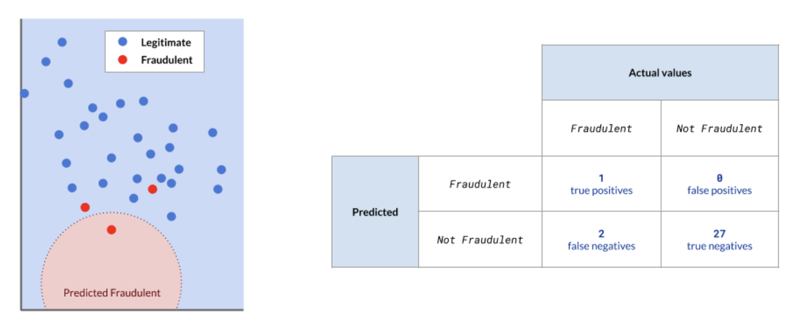
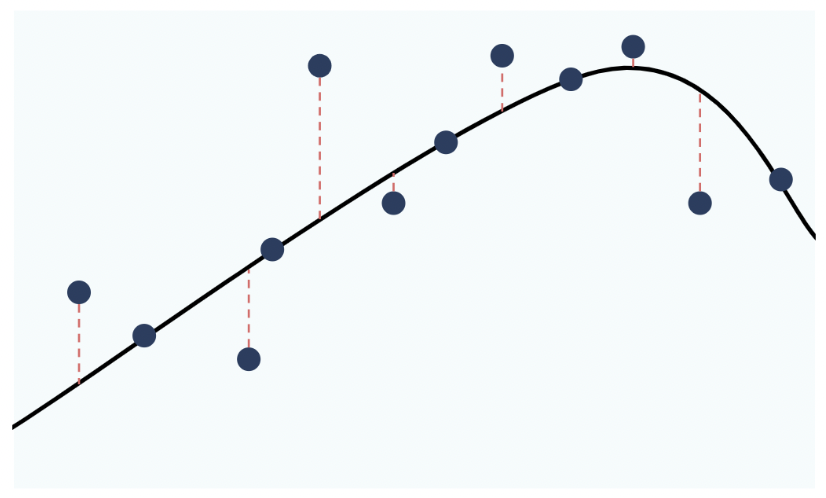
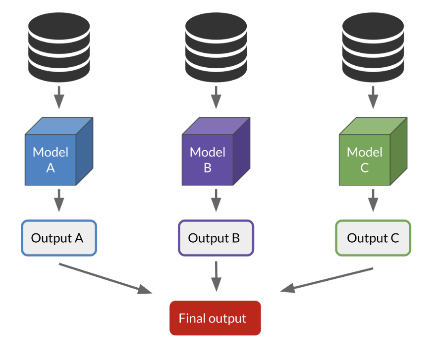

# 02-Machine Learning Models

There are several types to machine learning:

**Machine learning**

- Supervised learning
  - Classification
  - Regression

- Unsupervised learning [*difference in terms of applications*]
  - Clustering
  - Association
  - Anomaly detection

## Supervised learning

### What is supervised learning?

Supervised learning is basically **a labeling machine**. 

- It takes **an observation**, and assigns **a label** to it.

### Classification

Classification = assigning a **category** to an observation. 

- We're predicting **a discrete variable**, a variable that can only take a few different values. 

For example:

- Is this customer going to stop its subscription or not?  (Yes or No)
- Is this mole cancerous or not? (Yes or No)
- Is this wine red, white or rosé? 
- Is this flower a rose, a tulip, a carnation, a lily?

### Regression

Regression = assigns a **continuous** variable, 

- that is, a variable that can take **any value**. 

For example: 

- How much will this stock be worth?
- What is this exoplanet's mass?
- How tall will this child be as an adult?

### Classification vs regression

It's up to you to choose whether you want to frame your problem as a regression or classification problem. 

- Classification = **category**
  - One of few **specific values**
    - "Cold", "Mild", and "Hot"
- Regression = **continuous**
  - **Any value** within a finite (heifht) or infinite (time) interval

---

## Unsupervised learning

Unsupervised learning = **NO a target column** 

- Unsupervised learning **learns from the dataset**, and tries to **find patterns**. 

That means we can find insights without knowing much about our dataset.

### Clustering

Clustering = identifying **groups** in your dataset. 

The observations in these groups share **stronger similarities** with members of their group, than with members of other groups. 

> NOTE: You usually don't know **what differentiates your clusters** in real life. Your model won't tell you **why or how it decided on these clusters**. It's **up to you** to investigate and find out.

**Clustering models**

K-Means

- require you to specify/hypothesize in advance **the number of clusters** you would like to identify

DBSCAN (*Density-based spatial clustering of applications with noise*)

- DO NOT require you to specify the number of clusters in advance.
- require you to define **what constitutes a cluster**
  - like **the minimum number of observations in one cluster**.

### Anomaly detection

Anomaly detection = **detecting outliers**

Outliers = observations that **strongly differ from the others**

Some outliers are **errors** that can be removed. 

But, not always finding errors, detecting outliers can also help find:

- Which devices fail faster or last longer?
- Which fraudsters trick the protection systems in place?
- Which patients surprisingly resist a fatal disease?

### Association

To find **relationships between observations**.

In other words, it's about finding **events that happen together**. 

It's often used for **market basket analysis**, which is just a fancy expression to state **"Which objects are bought together?"**

For example:

- People who buy jam are likely to buy bread?
- People who buy beer are likely to buy peanuts?
- People who buy wine are likely to buy cheese?

---

## Evaluating performance

### Overfitting

The first thing to look for when evaluating is overfitting. 

That's when our model performs: 

- **great on training data**, but 
- **poorly on the testing data**. 

This is bad because it means:

- Model memorized training data and **CANNOT generalize learnings to new data** (*Here is what we want actually*).

Solution = we need to **split our dataset** into two sets.

### Classification :: Accuracy

Accuracy (%) = correctly classified observations / all observations

**Limits of accuracy: fraud example**

However, accuracy isn't always the best metric. 

Consider fraud where only **a small minority of transactions are fraudulent**. Let's say we train a model to predict whether a transaction is fraudulent or legitimate.

For example:

- It only misclassifies 2 points (28 correctly classified / 30 total points = 93.33%), giving it an accuracy of about 93%, which sounds good. 
- But the model actually misses the majority of fraudulent transactions, which will be a problem if we deploy this model in the real world. 
- We can even say all points are legitimate, and we get a 90% accuracy, but we miss all the fraudsters. 
- In this case, we need a better metric.

### Confusion matrix (For Sensitivity and Specificity)

Confusion matrix is also used to evaluate **classification** performance.

**Fraud example**

**True positives** = fraudulent points that are correctly classified as fraudulent.

- We only have one and that's the sole red point in the red area.

**False negatives** = fraudulent observations that are incorrectly classified as legitimate.

- We have two false negatives. These are the red points outside the red area.

**False positives** = legitimate points that are incorrectly predicted as fraudulent.

- There are no false positives here.

**True negatives** = legitimate points correctly predicted as not fraudulent. 

- These are the blue points in the blue area.

> NOTE: Positive means like 1 or Yes on the target variable that is the label that you are interested in checking that it happens.

### Classification :: Sensitivity :: Better than Accuracy

Sensitivity values accurate prediction of fraudulent transactions specifically by valuing true positives more. Here's the formula, which you don't need to memorize. 

Specificity focuses and values **True positives** than True negatives.

Sensitivity = True positives / (True positives + False negatives) = 1 / 3 = 33.33%

We get 33% sensitivity, which is **a bad score**. 

**Optimizing for sensitivity** means we'd rather **mark legitimate transactions as suspicious** than **authorize fraudulent transactions**. 

Now, we see our model isn't good at predicting fraud and needs improvement.

### Classification :: Specificity :: Better than Accuracy

Specificity = True negatives / True negatives + False positive

Specificity focuses and values **True negatives** than True positive.

This is useful metric for spam filters. 

- For an email user, it's better to send spam to the inbox rather than send real emails to the spam folder for deletion.

### Regression

**Error** = distance between point (actual value) and line (predicted value)

Many ways calculate this. e.g, **root mean square error**.

### Unsupervised learning

Well, remember, unsupervised learning **does not have predicted variables**, so there's no correct output to compare to. 

How well your unsupervised learning model performs depends on **the problem you're solving**. 

So, you assess the performance based on **how well the results advance your initial objective**.

---

## Improving performance

After we evaluate our model, we have to decide if the performance is good enough. 

Then you can improve your model if you're unsatisfied with its performance.

There are several options to improve your model, like:

- Dimensionality reduction
- Hyperparameter tuning
- Ensemble methods

### Dimensionality reduction

**Dimension** = **the number of features** in your data

**Dimensionality reduction** = **reducing the number of features**

Why? It is because: 

- Some of these features** might be **completely irrelevant**.\
- **Correlation** = Some features carry similar information
  - Keep only one feature
    - e.g. height and shoe size *- exclude one and leave only ->* height
  - Collapse multiple features into one underlying feature
    - e.g. height and weight *- can be calculated into ->* Body Mass Index

### Hyperparameter tuning

Depending on **your dataset**, different **hyperparameter values** will give better or inferior results.

- It is like **the parameters of the model algorithm itself** that make an impact to its model performance.

For example, **SVM (Support Vector Machine)** algorithm hyperparameters:

- **kernel**: linear *- to ->* polynomial
- C
- degree
- gamma
- shrinking
- coef0
- tol
- ...

There are many more hyperparameters that can be tuned in the SVM model. 

Playing with **different values for each hyperparameter** will impact **our model's performance**.

- You don't have to just guess combinations at random, **there are structured ways to find the optimal values**.

### Ensemble methods

The last option we want to cover is ensemble methods. This is a technique that combines several models in order to produce one optimal model.

For example, Imagine we're using three different models: models A, B and C:

**Ensemble methods: classification**

In a classification setting, we would use **voting**. 

If Model A and C say the student is accepted, and model B says she's not, 
then the observation is accepted, as it was **the most common prediction amongst all models**.

**Ensemble methods: regression**

In a regression setting, we use **averaging**. 

If Model A predicts a temperature of 5, Model B a temperature of 8, and Model C a temperature of 4, 
the observation gets assigned **the average value**, 5.67 degrees.

---
