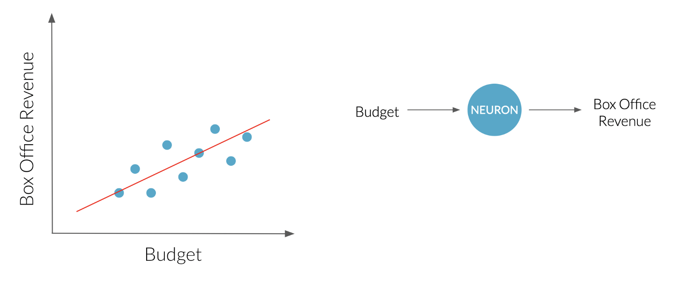
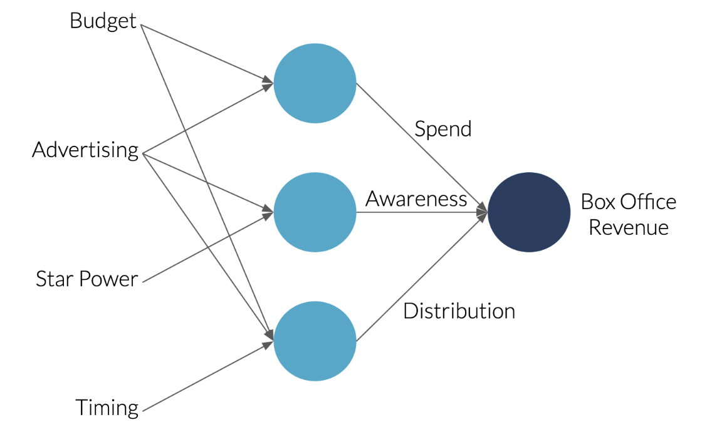
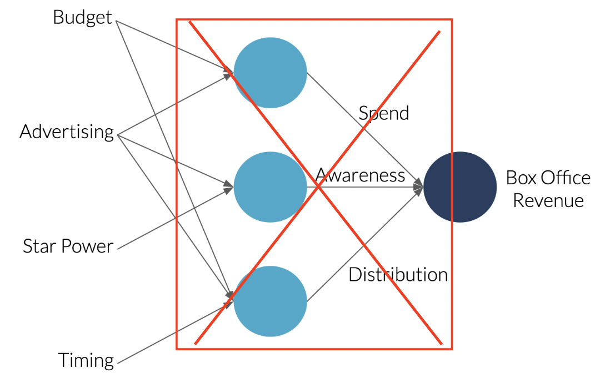
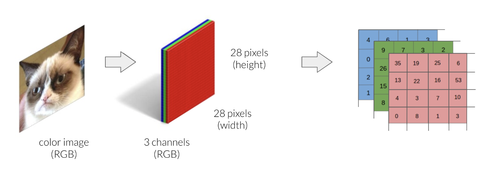
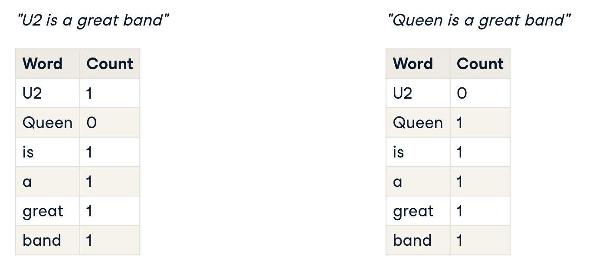
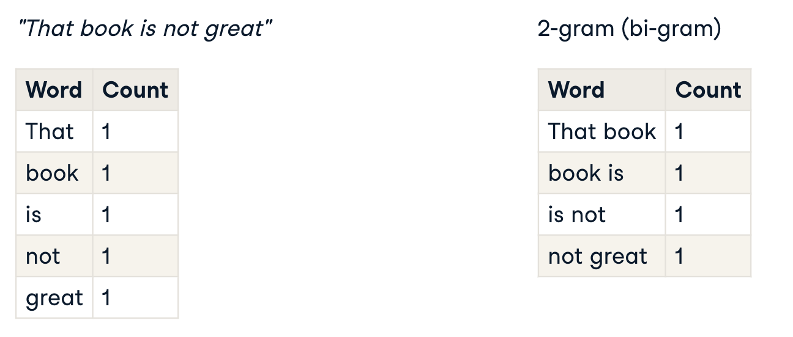
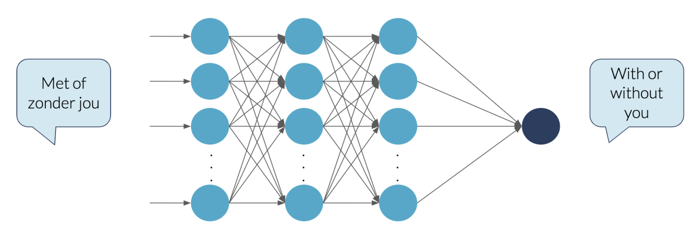

# 03-Deep Learning

## Deep learning

### What is deep learning?

Deep learning uses an algorithm called **neural networks**, which are loosely inspired by biological neural networks in human brains. 

- **Neurons**, also sometimes called **nodes**, are the basic unit of neural networks. 

Deep learning is **a special type of machine learning** that can solve more complex problems:

- Requires **much more data** than traditional machine learning
- Best used in cases where the **inputs are less structured**, such as large amounts of text or images.

### Predicting box office revenue

You have access to a dataset that maps past movies' box office revenue to their production budget.

As you can see, a straight line can be drawn through the data points, showing that as budget goes up, box office revenue increases. 

This red line is an example of a prediction from a simple model. 

The neural network that would accomplish this where budget is passed as input to a neuron that calculates the red curve, and outputs box office revenue.

Now, suppose that you have gained access to more information. Let's see what a more complex neural network looks like.

- First neuron whose job it is to estimate **spend** as a function of the budget and the advertising costs.
- Second neuron tracks how **aware** people are that the movie has been released.
- For the last neuron, Budget, advertising, and timing of the release all feed into this neuron to represents the **movie's distribution**.
- Finally, now that the earlier neurons have figured out the importance of these higher-level concepts, we need to add one more neuron that takes these three factors as an input and outputs **the estimated box office revenue**. 

And that's the end of our **neural network**. Its job is to **map relationships between different combinations of variables to the desired output**.

From the explanation it seemed as if we had to figure out key relationships like spend, awareness, and distribution. 

Actually, to train a neural network, **all you need is training data to input**. It figures out all of the neurons in the middle by **testing and analyzing relationships between the neurons** by the model itself while training the data.

### Deep learning in reality

We just saw an example of a rather small neural network. 

In reality neural networks are much larger with thousands of neurons. 

By stacking a large number of neurons they can compute incredibly complicated functions that give you very accurate mappings from the input to the output.

- The number of neurons in a neural network is unlimited.

### When to use deep learning?

- Deep Learning can outperform other techniques when **the data size is large**. 
  - But with **a smaller dataset**, traditional machine learning algorithms are preferable. 
  - On the other hand, 
    - **Traditional machine learning** algorithms **fail to improve** a whole lot when increasing the amount of data. 
    - With **deep learning**, however, as **the data increases** **the performance of the model also increases**.
- Because of the complexity, deep learning techniques **require powerful computers to train in reasonable time**. 
- **Automatic feature extraction**: When **there is lack of domain knowledge** for understanding the features that need to be used, deep learning outshines traditional machine learning since **the neural network figures them out for you**. 
- Deep Learning really shines when it comes to complex problems such as: 
  - Computer vision
  - Natural language processing.

---

## Computer vision

### What is Computer vision?

The goal of computer vision is to **help computers see and understand the content of digital images**. 

- For example, **self-driving cars**, manufacturers such as Tesla, BMW, Volvo, and Audi use multiple cameras to acquire images from the environment so that their self-driving cars can detect objects, lane markings, and traffic signs to safely drive.

### Image data

An image is made up of **pixels**. 

These pixels contain information about **color and intensity**.

For a grayscale pixelated image, each pixel's intensity can be represented by a number between 0 and 255.

A colored image is generally stored in the RGB system. 

RGB stands for Red, Green, and Blue. Each image can be thought of as being represented by three rasters, one for each color channel. This means that you need **three times the amount of data to store a color image** compared to a grayscale one. 

Also the number of features passed into the model is three-time to the grayscale image.

So, digital images can actually be seen as a bunch of numbers. Just like before, **these numbers can be used as features for your machine learning model**.

### Applications

- Facial recognition
- Self-driving vehicles
- Automatic detection of tumors in CT scans
- Deep fake
  - Not only can computer vision applications understand images, but we're also at the point, where they can create realistic images.
  - By understanding what makes up a human face, deep fake can generate new faces.

### Example :: Face recognition

Imagine you want to build a system to recognize people from pictures. 

The first step is to get some pictures, in this case from your lovely instructors, and use these as input.

- The intensities of each pixel can be passed into a neural network.

Its job is to figure out the identity of the person on the picture.

Just like before, the neurons in the middle will compute various values by themselves. 

Typically, when feeding a neural network images: 

- **neurons in the earlier stages** will learn to detect **edges** 
- **later neurons** on **parts of objects**, like eyes and noses for example, 
- **the final neurons** will learn to detect **shapes of faces**. 
- In the end, the network will put all of this together to output the identity of the person in the image.

**Training the neural network**

Don't forget, part of the magic of neural networks is that you **don't really need to worry about what it is doing in the middle**. 

All you need to do is give it **a lot of images of faces**, the features, as well as **the correct identity**, the labels, and during training the learning **algorithm will figure out by itself what each of these neurons in the middle should be computing**.

---

## Natural Language Processing

Natural Language Processing, or NLP, is **the ability for computers to understand the meaning of human language**. 

For example of NLP, the computer is able to **locate and classify named entities in the text** into **pre-defined categories** such as the names of persons and locations.

### Bag of words

Previously, the **features for our machine learning problems** have been **numbers or categories**. What do we do when our data is text? 

A simple option is to **count the number of times important words appear in each piece of text**. This technique is called **bag of words**.

Suppose we wanted to analyze the following two sentences: "U2 is a great band" and "Queen is a great band". We might end up with the word counts shown in the table.

### Bag of words: n-grams

Let's now consider the following sentence. 

When counting the individual words, "great" gets added to the list even though **the sentiment towards the book** is actually the opposite. 

This can be solved by **counting sequences of words**, a technique called **n-grams**. 

Here we are counting two-word sequences, allowing us to capture more information. 

Bag of words is a useful technique that is commonly used in NLP. There are some limitations but for how simple it is, it yields some pretty impressive results.

### Bag of words: limitations

Word counts don't help us consider synonyms. 

For example, there are many words that all mean "blue", such as "sky-blue", "aqua" and "cerulean". 

Ideally, we would like to group these as a single feature.

### Word embeddings

One **solution to the limitations of Bag of words** is **Word Embeddings**. 

It is a special way of **creating features that group together similar words**. 

- For example, word embeddings would create similar features for various shades of blue. 

Word embeddings have another interesting property: their features are **mathematical representations of words** that obey intuitive rules. 

- For example, in word embeddings, if we take the features for "King", subtract the features for "man", and add the features for "woman", we get a set of features that are very close to those of "queen".
  - **king - man + woman = queen**

### Language translation

After mapping words or sentences to **numbers**, with the **bag of words** technique or using **word embeddings**, we can pass them to **a neural network** whose job it is to translate **the input sentence** to **a different language**. 

Here you can see the dutch sentence, "met of zonder jou", being translated to "with or without you".

### Applications

- Language translation (such as Google Translate)
- Chatbots
- Personal assistants (such as Siri and Alexa)
- Sentiment analysis (to quantify how positive or negative the emotion expressed by a segment of text is)

---

## Limits of machine learning

- Data quality
- Explainability

### Data quality

- Garbage in garbage out
  - The quality of the output depends on the quality of the input. 
  - With bad data, applications that use machine learning will produce results that are inaccurate, incomplete or incoherent.

**Beware**

- Don't blindly trust your model
  - Be critical of its output. 
- Awareness of the role of data is key. 
- It is extremely important to pay attention to the data that is used. 

So although machine learning can be very powerful, keep in mind, **a machine learning model is only as good as the data you give it**.

**Quality assurance**

Having high quality data for the task at hand requires: 

- **Data analysis** including data characteristics, distribution, source, and relevance. 
- A review of **outliers**, exceptions, and anything that stands out as suspicious. 
- **Domain expertise** from experts to explain unexpected data patterns.
- **Documentation**: The process used must be **transparent** and **repeatable**.

### Explainability

One of the biggest challenges in AI is that often **machine learning models** are considered **black boxes**.

However, sometimes there is a need for AI systems to be **transparent about the reasoning it uses**, to increase **trust, clarity, and understanding**. 

For example, you will have to be able to explain your model to:

- get business adoption from a customer
- prove you are adhering to laws regarding data
- allow for faster and better bias detection

To sum, although deep learning can make very accurate predictions, it's not always clear why the model is making a specific prediction.

Methods that allow us to understand **the factors that lead to each prediction** are also known as **explainable AI**.

**Blackbox**

- Deep learning
- Better for "What?"
- Highly accurate prediction

**Explainable AI**

- Traditional Machine Learning
- Better for "Why?"
- Understandble by humans

### Explainability :: Examples

**Example: Explainable AI**

- **Prediction**: Will the patient get diabetes?
- **Inference**: Why will this happen?

Suppose a hospital is using **a traditional machine learning model** to look at diabetes patient data. 

The trained model can tell us two things. 

- First, it can predict the onset of Type 2 diabetes. 
- Second, it can say **which features were important** in making this decision. 
  - This is the **"explainable"** part. 

This additional explainability can provide **important insights** for doctors, like if **blood pressure** is an important **predictor of future diabetes**.

**Example: Inexplicable AI**

- **Prediction only**: Which letter is this likely to be?

Contrast that example with **a typical deep learning problem**. 

Suppose we want to **recognize hand-written letters**. 

We **don't really care why** a particular image was classified as an "a", **as long as the predictions are highly accurate**. 

**Deep learning** is a perfect solution to this problem because we **don't care about explainability** in this case.

**Summary**

- Problems with complex inputs like **large quantities of text or images** require **a deep learning approach** and can be considered black boxes. 
- Problems where it is helpful to know **why the alogrithm chose a particular classification** should be tackled with **Explainable AI**.

---
